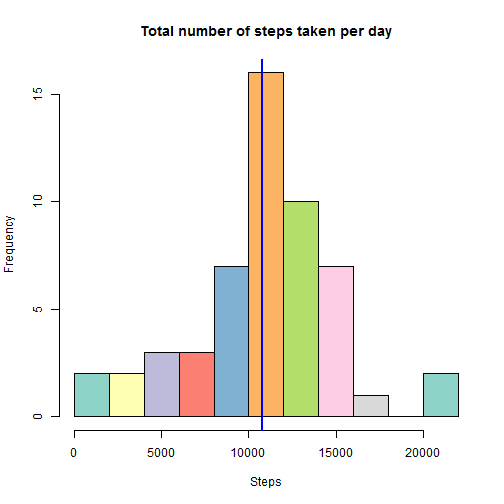
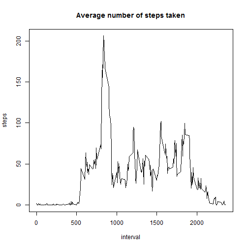
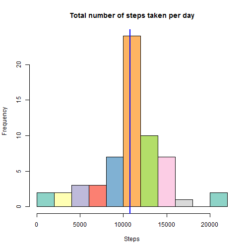
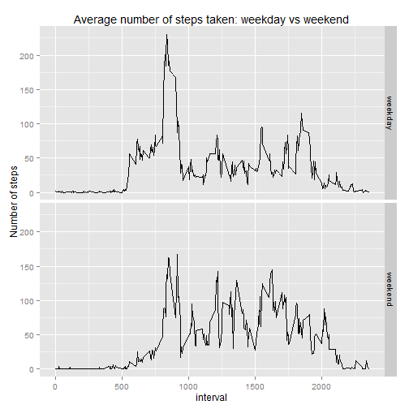

## Loading and preprocessing the data

```r
library(dplyr)
library(ggplot2)
library(RColorBrewer)

Sys.setlocale("LC_TIME", "English") # locate for date operations

data <- read.csv("activity.csv", sep=",", header=TRUE)

bydate <- 
    data %>%
    group_by(date) %>% 
    summarize(avg = mean(steps), total=sum(steps))

byinterval <- 
    data %>%
    filter(!is.na(steps)) %>%
    group_by(interval) %>% 
    summarize(avg = mean(steps), total=sum(steps))
```


## What is mean total number of steps taken per day?

Histogram of daily steps (with mean drawn as blue line):

```r
hist(bydate$total, breaks=10, main="Total number of steps taken per day", xlab="Steps", col=brewer.pal(10,"Set3"))
abline(v = mean(bydate$total,  na.rm = TRUE), col = "blue", lwd = 2)
```

 

Mean:

```r
mean(bydate$total,  na.rm = TRUE)
```

```
## [1] 10766.19
```

Median:

```r
median(bydate$total,  na.rm = TRUE)
```

```
## [1] 10765
```


## What is the average daily activity pattern?

Time series of the 5-minute interval (x-axis) and the average number of steps taken, averaged across all days (y-axis):

```r
plot(byinterval$interval, byinterval$avg, type = "l", main="Average number of steps taken", xlab="interval", ylab="steps")
```

 

Which 5-minute interval, on average across all the days in the dataset, contains the maximum number of steps:

```r
highest <- byinterval[which.max(byinterval$avg),]
highest$interval
```

```
## [1] 835
```


## Imputing missing values

Total number of missing values in the dataset:

```r
nrow(data[is.na(data$steps),])
```

```
## [1] 2304
```

**Strategy for imputing missing data:** Fill NAs using average steps for that interval from other days. E.g. if an interval 125 has NA steps, the steps estimate for that row is average of all rows having interval 125 and non-NA steps value.


```r
# create vector with the same length as data set, having average steps for the interval in each row
avg <- sapply(data$interval,  function(i) {byinterval[ byinterval$interval==i, ]$avg})

# add new col "estimatedSteps"  steps
# it's same as steps, except if row has NA steps the value is taken from average steps for that interval
data$estimatedSteps <- ifelse(is.na(data$steps), avg, data$steps)
```

New histogram of the total number of steps taken each day after missing values were imputed:

```r
# group estimated steps by date
estimatedByDate <- 
    data %>%
    group_by(date) %>% 
    summarize(avg = mean(estimatedSteps), total=sum(estimatedSteps))

# histogram using estimated steps
hist(estimatedByDate$total, breaks=10, main="Total number of steps taken per day", xlab="Steps", col=brewer.pal(10,"Set3"))
abline(v = mean(estimatedByDate$total), col = "blue", lwd = 2)
```

 


## Are there differences in activity patterns between weekdays and weekends?

For this plot we use previously calculated estimated steps for NAs. Results show there are some differences, weekdays seem to have more steps in the morning, weekends have more steps during rest of the day:


```r
# vector of dates in dataset as string, e.g. "Monday"
days <- weekdays(as.Date(data$date))

# add new factor variable "daytype" in the dataset with two levels - "weekday" and "weekend"
data$daytype <- factor(ifelse(days=="Saturday" | days=="Sunday", "weekend", "weekday"))

# group data by interval and daytype
byIntervalAndType <- 
    data %>%
    group_by(interval, daytype) %>% 
    summarize(avg = mean(estimatedSteps), total=sum(estimatedSteps))

# plot it, split plots by daytype
g<-ggplot(byIntervalAndType, aes(interval, avg)) + 
    geom_line() +
    facet_grid(daytype ~ .) + 
    ylab("Number of steps") +
    ggtitle("Average number of steps taken: weekday vs weekend")

print(g)
```

 
